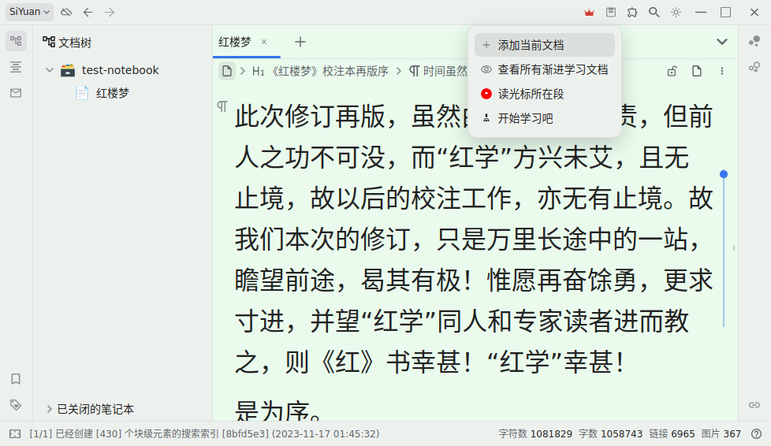
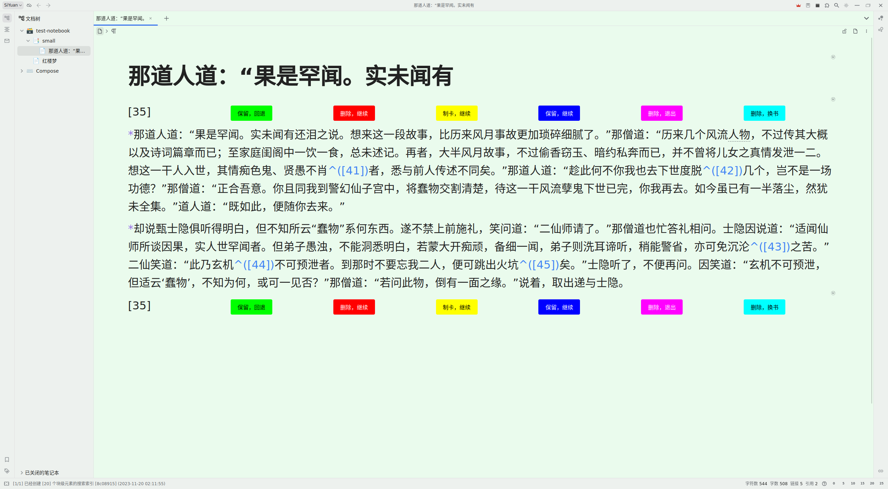

[中文](https://github.com/IAliceBobI/sy-progressive-plugin/blob/main/README_zh_CN.md)

# Progressive Learning

I often struggle to finish reading long documents or imported e-books.

There are also many imported books in the SY knowledge base. I wanted to make use of fragmented time to read some books, but choosing which book to read became a problem.

By chance, I learned about the basic methods and some superficial information about progressive learning and decided to give it a try. That's why I developed this plugin.

The purpose of this plugin is to divide a document in SY into small segments and read them one by one. During the reading process, you can take notes and create flashcards for future review.

The current implementation of the plugin is relatively basic.

As for whether using it can improve learning efficiency, let me use it for a few months first... add some features... fix some bugs... and then we'll see!

Now let's briefly explain how to use it.

## Adding a Document

**Open the plugin menu and click on `Add Current Document`.**

After adding a document, the plugin will perform the segmentation operation.

If the document is large, like the one shown in the image, with millions of words, the segmentation process may take a while. Please be patient.

The segmentation operation of the plugin does not modify the original text or create new documents. It only reads, counts, and builds indexes.

> **Note:** After creating an index, please do not modify the original document, such as deleting certain sections, as it may cause the learning plugin to be unable to locate those sections.

## Start Learning

**Open the plugin menu and click on `Start Learning`.**

> The shortcut for `Start Learning` is `Alt+-`, which is right after `Flashcards` `Alt+0`. Two shortcuts, one for learning and one for reviewing.

* `=== Separator` - The notes area is below the separator and can be preserved. The text above the separator is the original text with remarks added by the plugin, please do not modify it.
* `[0]` - Segments are numbered starting from 0, where 0 represents the beginning of a book. The second segment is `[1]`.
* `Keep and Go Back` - Keep the notes for the current segment and go back to the previous segment.
* `Delete and Continue` - Discard the notes for the current segment and continue to the next segment.
* `Create Flashcard and Continue` - Keep the notes for the current segment and turn the current document into a flashcard. The original text will be deleted, and a link to the original text will be added. Continue to the next segment.
* `Keep and Continue` - Keep the notes for the current segment and delete the original text. Continue to the next segment.
* `Delete and Exit` - Discard the notes for the current segment. Exit the learning process.
* `Delete and Switch Book` - Discard the notes for the current segment. Choose another document that has been added to the "Progressive Learning" plugin.

> **Reminder:** The titles of each snippet in the document can be modified. However, please do not modify the document's notes, as the plugin may not be able to find the document in the future.

## Read the current paragraph

Open a document that has been annotated with incremental learning. Scroll to a specific position and place the cursor there. Then, select the option "Read the current paragraph" from the plugin menu to open the fragment that contains the current block.

Alternatively, you can use the right-click menu: `Plugin` -> `Read the current paragraph`

# Bug Reports, Suggestions

QQ Group: 263961482

[Or submit issues on Github](https://github.com/IAliceBobI/sy-progressive-plugin/issues)

[Or submit issues on the official forum](https://ld246.com/tag/siyuan)

# Changelog

## 2023-11-17

* First version
