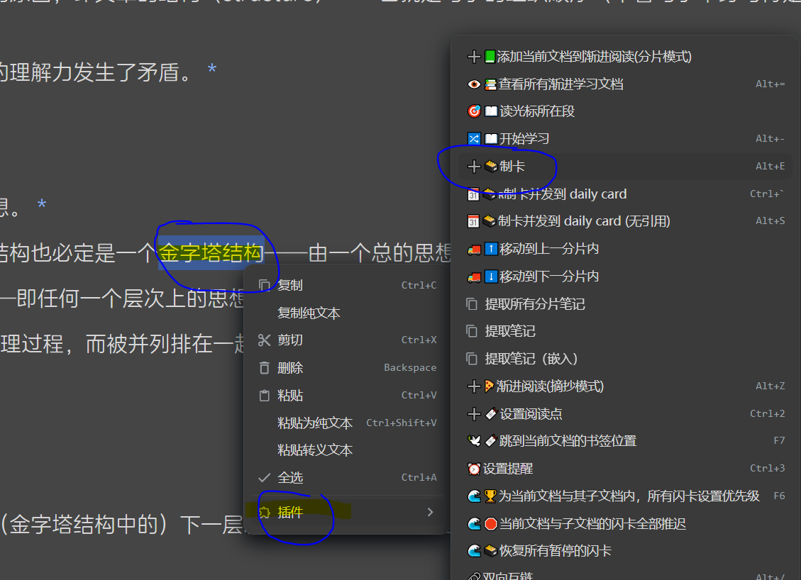

[中文](https://github.com/IAliceBobI/sy-progressive-plugin/blob/main/README_zh_CN.md)

# Progressive Learning

The purpose of this plugin is to divide long documents into smaller segments called "chunks" and read them one by one progressively. During the reading process, you can take notes and create flashcards for future review.

Let's talk about how to use it.

## Add Documents

**Select a long document for progressive learning. Open the plugin menu and click on "Add Current Document".**

There are two ways to split the document: by headings or by word count. You can use them together or separately, as shown in the image:

> The name "small" in the image is just for testing purposes, ignore it!

After adding the document, the plugin will perform the "chunking" operation.

If the document is large, like the one in the image with millions of words, the "chunking" process may take some time, so please be patient.

The "chunking" operation of the plugin does not modify the original text or create new documents. It only reads, analyzes, and saves the chunks.

The "Auto Flashcards" option means that each chunk will be turned into a flashcard when it is read.

> **Note:** After the document is divided into chunks, avoid making any modifications to the original text, such as deleting sections, as it will cause the plugin to not be able to locate those sections during learning.

> **Reminder:** Even when splitting the document only by headings, the speed is still fast for a document with millions of words.

## Start Learning

**Open the plugin menu and click on "Start Learning".**

> The shortcut for "Start Learning" is `Alt+-`, following the shortcut for "Flashcards" `Alt+0`. One for learning and the other for review.

**Each "chunk" has a "chunk number" prefix in its title.**

**Within each "chunk", there is a "*" at the end of each paragraph that links back to the original document.**

**You can freely modify the content within each "chunk", add paragraphs, create flashcards, and insert the original text at any time.**

> **Reminder:** The updating of the index may lag slightly after modifying the content, as the plugin relies on the index. If you modify the text and immediately click the button, it may not take effect.

* `[Chunk Index]`: Chunks are counted starting from 0. `[0]` represents the beginning of a book. The second chunk is `[1]`.
* `⬅`: Retain notes from the current segment and view the content of the previous `chunk`.
* `➡`: Retain notes from the current segment and view the content of the next `chunk`.
* `⬇`: Insert the content of the corresponding `chunk` from the original text.
* `🧹`: Modified parts of the original text will be retained, while unmodified parts will be deleted.
* `🗑 ➡`: Delete notes from the current segment and continue to the next `chunk`.
* `➡ 🗃`: Convert the current document into flashcards.
* `🗃 ➡`: Delete the flashcards of the current document itself, without affecting flashcards within the document.
* `🏃`: Retain notes from the current segment. Exit learning mode.
* `📚📖`: Retain notes from the current segment. View other documents that have been added to the "Progressive Learning" plugin.
* `🚫`: Stop pushing this book. It can be reopened in the "View All Progressive Learning Documents" section.

> **Reminder:** When a "chunk" is deleted, its associated document flashcards will also be deleted.

> **Reminder:** If a deleted "chunk" is encountered again during the learning process, it will be recreated.

> **Reminder:** The title of each "chunk" can be modified. However, do not modify the document's remarks, otherwise, the plugin will not be able to locate the document in the future.

## Read the Section at the Cursor

If you want to start reading from a specific part of the original document, you can use the "Read Section at Cursor" feature.

Open an original document that has been added to Progressive Learning, navigate to a certain position, right-click, and go to `Plugin` -> `Read Section at Cursor` to jump to that "chunk".

## Fill-in-the-Blank Flashcards

Select the portion of the text you want to create a flashcard for, for example, the word "Story" in the image below:

When generating flashcards, include an input box for writing.

Writing the answer on the flashcard will enhance the effectiveness, as you can review the previous thoughts/answers when revisiting it.

For writing articles, you can create ambiguous fill-in-the-blank sections and continuously engage in thinking and writing through the flashcard mechanism—progressive writing.

> **Tip:** Flashcard type B includes a quote block for the writing section, while type C includes a code block.

# Plan

- [ ] Merge a large number of saved fragments into a single document?

# Bug Reports and Suggestions

The plugin needs everyone, including me, to contribute to its improvement through long-term usage. If you have any issues or suggestions, we can discuss them together.

QQ Group: 263961482

[Alternatively, submit issues on GitHub](https://github.com/IAliceBobI/sy-progressive-plugin/issues)

[Alternatively, submit issues on the official forum](https://ld246.com/tag/siyuan)

# Changelog

## 2023-11-23

* Add tooltips to buttons and change button text.
* [Update button color scheme](https://github.com/IAliceBobI/sy-progressive-plugin/issues/1)
* Set shortcut keys for cloze flashcards.

## 2023-11-22

* Added the option for automatic flashcard creation in documents, enabled by default.
* Fixed several bugs.
* Redefined the button row.
* Added the shard number before the title of a new document.

## 2023-11-21

* Greatly improved the speed of processing based on the title "Shard" only.
* Moved the asterisk (*) at the beginning of each sentence in a "Shard" to the end of the sentence.
* Added fill-in-the-blank flashcard functionality.
* Added the option to ignore books.
* i18n.

## 2023-11-20

* Removed the distinction between the original text area and the note area. Any modified content, including flashcard creation and appearance, will be saved.
* Optimized the note-saving method.
* Removed unnecessary introduction in the readme and directly started with the content.

## 2023-11-19

* Improved existing features.
* Fixed some bugs.

## 2023-11-17

* Initial release.