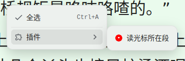

[中文](https://github.com/IAliceBobI/sy-progressive-plugin/blob/main/README_zh_CN.md)

# Progressive Learning

I often struggle to finish reading long documents or imported e-books.

There are also many imported books in the SY knowledge base. I wanted to make use of fragmented time to read some books, but choosing which book to read became a problem.

By chance, I learned about the basic methods and some superficial information about progressive learning and decided to give it a try. That's why I developed this plugin.

The purpose of this plugin is to divide a document in SY into small segments and read them one by one. During the reading process, you can take notes and create flashcards for future review.

The current implementation of the plugin is relatively basic.

As for whether using it can improve learning efficiency, let me use it for a few months first... add some features... fix some bugs... and then we'll see!

Now let's briefly explain how to use it.

## Adding a Document

**Open the plugin menu and click on `Add Current Document`.**

After adding a document, the plugin will perform the segmentation operation.

If the document is large, like the one shown in the image, with millions of words, the segmentation process may take a while. Please be patient.

The segmentation operation of the plugin does not modify the original text or create new documents. It only reads, counts, and builds indexes.

> **Note:** After creating an index, please do not modify the original document, such as deleting certain sections, as it may cause the learning plugin to be unable to locate those sections.

## Start Learning

**Open the plugin menu and click on `Start Learning`**

> The shortcut for `Start Learning` is `Alt+-`, located right after the `Flashcards` shortcut `Alt+0`. Two shortcuts, one for learning and one for reviewing.

* `Two [..]`: On the left is the starting position of the excerpt in the original text, and on the right is the ending position.
* `[514]`: Excerpts are counted starting from 0, where `[0]` represents the beginning of a book. The second excerpt would be `[1]`.
* `Keep, Go Back`: Keep the notes for the current segment and go back to the previous excerpt.
* `Delete, Continue`: Discard the notes for the current segment and continue to the next excerpt.
* `Create Card, Continue`: Keep the notes for the current segment and turn the current document into a flashcard. Finally, remove the original text and add a link to the original text. Continue to the next excerpt.
* `Keep, Continue`: Keep the notes for the current segment and remove the original text. Continue to the next excerpt.
* `Delete, Exit`: Discard the notes for the current segment. Exit the learning process.
* `Delete, Switch Book`: Discard the notes for the current segment. Choose another document to add to the Progressive Learning plugin.
* `Separator`: Below the separator is the note area, which can be kept. Above the separator is the original text with the plugin's annotations. Do not modify it.

> **Reminder:** The titles of each snippet in the document can be modified. However, please do not modify the document's notes, as the plugin may not be able to find the document in the future.

## Read the Paragraph at the Cursor

Open a raw document that has been added to progressive learning, browse to a certain position, right-click menu: `Plugins`->`Read the Paragraph at the Cursor`

# Plan

- [ ] Improve the existing note-taking method and flashcard creation method.
- [ ] Enhance i18n.

# Bug Reports and Suggestions

QQ Group: 263961482

[Or submit issues on GitHub](https://github.com/IAliceBobI/sy-progressive-plugin/issues)

[Or submit issues on the official forum](https://ld246.com/tag/siyuan)

# Update Log

## 2023-11-19

* Improve existing functionality.
* Fix some bugs.

## 2023-11-17

* First version