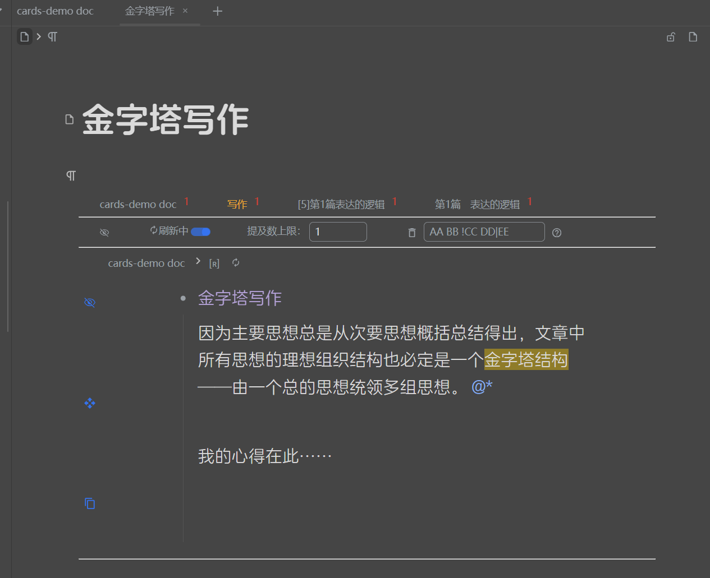
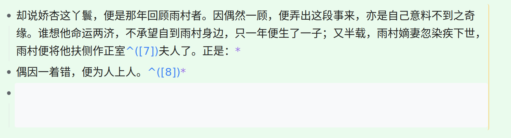
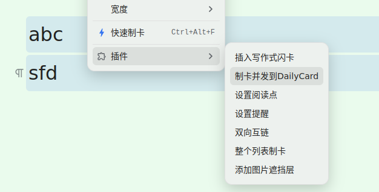
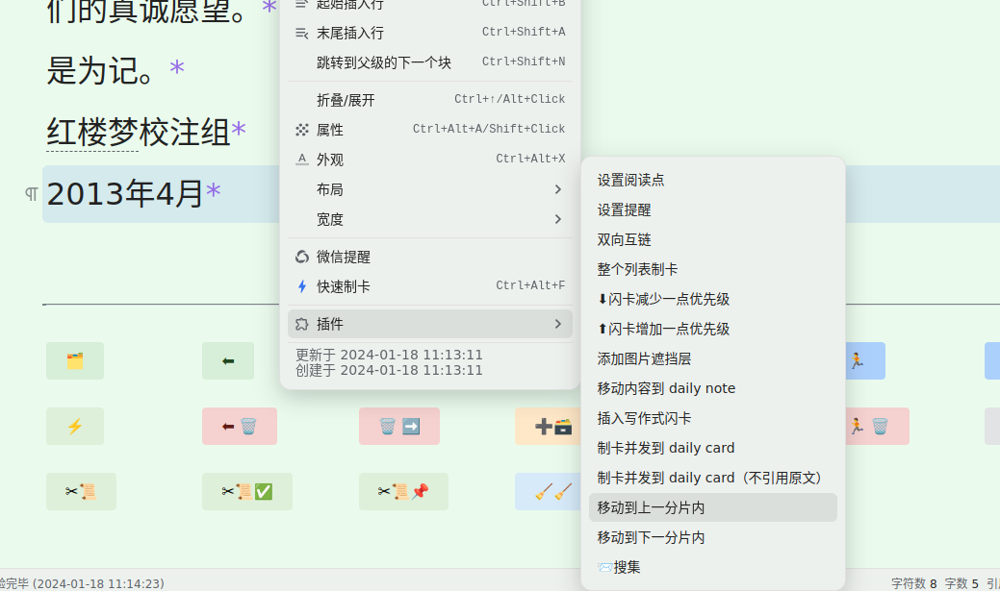
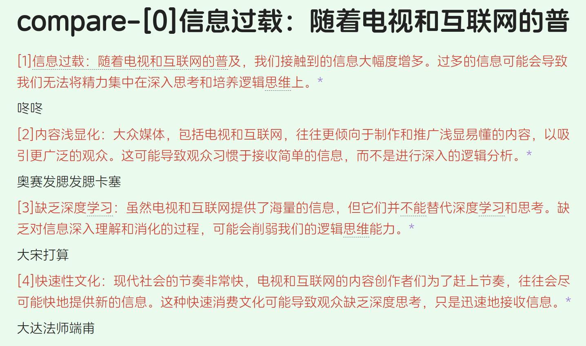

[中文](https://github.com/IAliceBobI/sy-progressive-plugin/blob/main/README_zh_CN.md)

# Progressive Reading Based on `Digesting` (Digesting Mode)
<details>
  
  > [I guess the image below is probably broken 😢, check here!](https://gitee.com/TokenzQdBN/sy-progressive-plugin/blob/main/README_zh_CN.md)
  
  ## Usage
  
  
  
  **Default shortcut: `Alt+Z`.** This is a menu with multiple functions.
  
  It can also be used in read-only mode with the shortcut `Alt+Z`.
  
  You can digest any document, typically used for progressive reading of imported books.
  
  To minimize disruption during reading, you can first digest the content you find valuable, which will appear later during flashcard review.
  
  Select multiple lines and use `Alt+Z -> 🍕 Digest` or `Alt+Z -> ✂ Digest and Break Sentences by Punctuation`.
  
  You can further digest the digested content, allowing infinite nesting.
  
  The digested documents have the same function and style as the `fragments` in the `fragment mode`.
  
  > **Pressing the shortcut `Alt+Z` twice consecutively triggers digesting.**
  
  ## Lightweight
  
  Compared to the `fragment mode`, there is no automatic fragmentation process. By selecting multiple content blocks in a document, you can perform digesting.
  
  It's akin to manual `fragmentation`. Selecting content blocks can create `fragments`.
  
  > **Note:** You can use digesting on `fragments` generated by the `fragment mode`.
  
  > **Note:** `Digesting mode` can be used simultaneously with `fragment mode`.
  
  ## Flattened
  
  Multi-level digesting does not create multi-level folders. All digests are in the same folder.
  
  ## Word & Flashcard
  
  
  
  ## Card Creation
  
  
  
  It can also be used in read-only mode with the shortcut.
  
  Digesting can be seen as a draft, where you can jot down notes and then create cards.
  
  Card creation can use the following: ``` Writing-style Flashcards Alt+` ```, `Card Creation Alt+E`, ``` Daily Card Alt+S and Alt+` ```
  
  ## Review
  
  It is recommended to use the `flashcard button` in the `toolbar` of the `Tomato Toolbox`. This `tab` method of reviewing flashcards allows for convenient digesting.
  
  ## Flashcard Transfer Strategy (Multiple)
  
  Each digest is turned into a flashcard.
  
  > `Alt+Z -> 🗃️` can switch to the `single` mode.
  > Each book has its own `flashcard transfer strategy`.
  
  ## Flashcard Transfer Strategy (Single)
  
  > `Alt+Z -> 🗃️` can switch to the `multiple` mode.
  
  Each time a digest is made, the flashcard for that digest is maintained.
  
  Among all digests of a book (a document), only one digest has a flashcard.
  
  This strategy determines which digest gets the flashcard, so it appears in flashcard review.
  
  When creating a digest, the flashcard always transfers to the newly created flashcard.
  
  After clicking `Alt+Z -> 🔨` on the flashcard, the digest is marked as `completed`, and the flashcard will transfer to another `incomplete` digest.
  
  Considering that you may manually select any digest for study in the document tree, the following strategy is defined for easy backtracking after free exploration:
  
  The flashcard of the current digest will preferentially transfer to an older digest that is closest in time to itself and open it.
  
  If there is none, the flashcard will transfer to the most recently created digest and open it.
  
  If there are no `incomplete` digests left, it will jump to the original content block corresponding to the digest where `Alt+Z -> 🔨` was just clicked.
  
  > The review count of flashcards does not accumulate; it is cleared with each transfer.
  
  > New flashcards will automatically be marked as difficult once and have their due date reset to the current time (consistent with the `reading point` strategy of the `Tomato Toolbox`), allowing immediate review.
  > This operation is to adjust the next review time corresponding to each difficulty level.
  
  ## Open Previous, Next Digest
  
  `Alt+Z -> 👈` `Alt+Z -> 👉`
  
  Using this function on a digest will open the digest in the original text that is close in proximity.
  
  ## Clean Up Completed Digests
  
  Use within any digest file:
  
  `Alt+Z -> 🗑️` will delete the digest files in the completed state.
  
  ## Digest Trace Chain `Alt+Z -> 🌲`
  
  
  
  Use within any digest file:
  
  `Alt+Z -> 🌲` will open the trace file. Each line represents a digest path, with each node on the path being a digest file, ultimately pointing to the original text.
  
  
</details>

# Shard-Based Incremental Reading (Shard Mode)
<details>
  
  Divide long documents into smaller segments, referred to here as `shards`, and read each `shard` one by one. During the reading process, you can take notes and create flashcards.
  
  This method opens up the possibility of reading multiple books and materials simultaneously.
  
  * **Recommended In-Depth Reading**:
    * [Incremental Reading Process in SiYuan Notes with Incremental Learning Plugin - Zhihu](https://zhuanlan.zhihu.com/p/676485932)
    * [Incremental Reading Process in SiYuan Notes with Incremental Learning Plugin - ChainDrop](https://ld246.com/article/1704599752251)
  
  **Note:** *Flashcards are the core; this plugin merely helps us read books more comfortably and consistently, thereby extracting high-quality flashcards from them.*
  
  > [Donate to encourage development, click here](https://gitee.com/TokenzQdBN/sy-progressive-plugin/blob/main/README_zh_CN.md#bug-feedback-and-suggestions)
  
  ## Adding Documents
  
  The first step to start using this is to open a book.
  
  If you don't have a book, you can import one using other plugins.
  
  **Open a longer document for incremental learning. First, open the plugin menu and click `Add Current Document`.**
  
  
  
  The plugin will prompt you to split the document. As shown in the figure:
  
  
  
  Here, you are provided with three splitting methods: `Headings`, `Block Count`, and `Word Count`. These methods can be used together or individually.
  
  When combined, the splitting methods follow a sequence: `As shown in the figure, from top to bottom, split first by headings, then each section by block count, and finally each block by word count.`
  
  It sounds a bit complex, but in actual use, it's not that complicated.
  
  I've summarized three common methods below; choose one for a book.
  
  > [If images do not load, please check here](https://gitee.com/TokenzQdBN/sy-progressive-plugin/blob/main/README_zh_CN.md)
  
  **1. Split by Headings**
  
  Books are usually composed of various levels of headings. Splitting by headings will divide the book into multiple shards based on the input headings. Default splits include h1~h6. If you don't want to split h5 and h6, you can input: "1,2,3,4".
  
  For example, when splitting a web novel, which typically has only major headings, each heading represents a chapter, so each shard is a chapter of the novel.
  
  If the book is more complex, with sections and subsections, each shard will be a subsection.
  
  If a subsection is still too large to fully grasp in one reading, you can read it roughly first, then add new appropriate level headings based on your understanding. Then, for this shard, you can perform another round of `split by headings`.
  
  *The plugin supports further splitting of shards.*
  
  **2. Split by Headings + Word Count**
  
  If you want to control the word count of each shard, use this method. However, note that if the book has many words, the splitting process will take a long time...
  
  For larger documents, such as a three-million-word document, splitting by word count can be time-consuming.
  
  Therefore, you can use a combination of headings and block count.
  
  **3. Split by Headings + Block Count**
  
  To control the word count of shards and quickly split the book, use the headings + block count method.
  
  This method roughly controls the word count of each shard, but it's not precise. Hmm... it seems a bit imprecise...
  
  > The `shard` operation of the plugin does not modify the original text or create new documents; it only reads, counts, and saves.
  
  > `Automatic Card Creation` means that each `shard` is turned into a flashcard when read.
  
  > **Note** Some book content may require repeated consideration to extract high-quality flashcards, and `automatic card creation` only creates rough cards.
  
  > **Caution** After `sharding`, do not modify the original book, such as deleting blocks, as this will cause the plugin to fail to find these blocks during learning.
  
  ## Starting to Learn
  
  After successfully adding a book, we proceed to the reading phase.
  
  **Opening the plugin menu and clicking `Start Learning` will open the first segment of the book.**
  
  > The shortcut for `Start Learning` is `Alt+-`, which is right after `Flashcards` `Alt+0`. One is for learning, the other for review.
  > Open a random segment: `Alt+Shift+-`
  
  
  
  > [If you can't open the image, click here](https://gitee.com/TokenzQdBN/sy-progressive-plugin/blob/main/README_zh_CN.md)
  
  **The `Segment` title has a `Segment Number` prefix.**
  
  **At the end of each paragraph in the `Segment`, there is a `*` linking to the original document.**
  
  **The content in the `Segment` can be freely modified, paragraphs can be added, cards can be made, etc. Original text can be inserted at any time.**
  
  > **Tip** After modifying the content, the update of the `Index` will be slightly delayed, and the plugin relies on the `Index`. If you click a button immediately after modifying the text, it may not take effect.
  
  * `🗂`: Open the book's table of contents, which can be used to locate the desired segment.
  * `⬅`: Go to the previous `Segment`.
  * `➡`: Go to the next `Segment`.
  * `⬇`: Insert the content of the corresponding `Segment` from the original text.
  * `🧹🧹`: Delete the original text.
  * `⬅ 🗑`: Delete the current segment and go to the previous `Segment`.
  * `🗑 ➡`: Delete the current segment and go to the next `Segment`.
  * `🗑 🏃`: Delete the current segment.
  * `＋🗃`: Turn the current document into flashcards.
  * `－🗃`: Delete the flashcards of the current document itself, without affecting the flashcards within the document.
  * `🏃`: Close the segment.
  * `📚📖`: Switch to another book.
  * `🚫`: Stop pushing this book, and it can be reopened in `View All Progressive Learning Documents`.
  * `⚡`: Review the flashcards of the current book.
  * `✂📜`: Split the original text within the segment according to punctuation, creating a layout with one sentence per line for easier reading.
  * `✂📜✅`: Break sentences according to punctuation, forming a task list (tasks can be checked off with ctrl+enter).
  * `✂📜📌`: Same as above, but the split content is displayed as an unordered list.
  
  > **Tip** When a `Segment` is deleted, its document flashcards are also deleted.
  
  > **Tip** Deleted `Segments` will be recreated if they are read again.
  
  > **Tip** The document title of each `Segment` can be modified. However, do not modify the document notes, otherwise, the plugin will not be able to find the document later.
  
  ## Reading the Paragraph Under the Cursor
  
  If you want to start reading from a specific part of the original document, you can use the `Read the Paragraph Under the Cursor` feature.
  
  Open an original document that has been added to progressive learning, navigate to a specific location, right-click the menu: `Plugin` -> `Read the Paragraph Under the Cursor`, and you will jump to this `Segment`.
  
  
</details>

## Making Flashcards
<details>
  
  ### Making Cloze Cards `Alt+E`
  
  Select the content to be `cloze deleted`, such as in the image:
  
  
  
  The flashcard will be created in a new file on the right and the file will be opened.
  
  Flashcards are created in list form, making it easy to write down your thoughts below.
  
  
  
  Some flashcards can be tagged with multiple references, separated by spaces, as shown in the following image:
  
  
  
  This allows you to view all related content in the backlink panel.
  
  We continue to think and progressively write through the flashcard mechanism.
  
  
  
  > Recommended to be used with the `Pomodoro Toolbox` feature `Flashcard Priority` and `Bottom Backlinks`.
  
  > [If you can't open the image, click here](https://gitee.com/TokenzQdBN/sy-progressive-plugin/blob/main/README_zh_CN.md)
  
  ### Making Cards Directly, Without Cloze Deletion, Still `Alt+E`
  
  Place the cursor in the content without selection, and make flashcards using the menu or shortcut key.
  
  ### Multi-line Selection, or `Alt+E`
  
  The following image shows two lines selected:
  
  
  
  > Use the shortcut key: `Alt+E`
  
  This will generate and insert a flashcard below, as shown in the image:
  
  
  
  > **Note** If card creation is done within a segment, the cards will be placed in a subfolder of the book. For example, if the book is named ABC, all cards will be collected in the ABC-cards file.
  
  ### Daily Card `Alt+S` or `Ctrl+`
  
  Right-click menu or shortcut keys `Ctrl+` to quote the original text or `Alt+S` to not quote the original text to create cards, which will be archived in the Daily Card folder. The result is similar to Daily Note.
  
  
  
  This will create the following directory structure and make cards:
  
  
  
  ### Writing-style Flashcards `Alt+`
  
  
  
  After creation, the original text will also insert an embedded block of the flashcard, and the content created in the flashcard will also reflect in the original text.
  
  
  
  ### Multi-line Cloze `Alt+D`
  
  
  
  The official `Alt+D` can be deleted, and the plugin's `Alt+D` will automatically take effect.
  
  This implements the official cloze deletion function and adds a multi-line cloze deletion feature.
  
  Select multiple lines, and use `Alt+D`.
  
  When reviewing flashcards, the content that has been blanked out is treated as the answer and is hidden.
</details>

## Command Palette Tool
<details>
  
  Replace `*` and `@` with hyperlinks `siyuan://`. Shortcut key `F9`.
</details>

## Move Blocks within Segments to Previous or Next Segment
<details>
  
  
</details>

## Collection Function `alt+shift+z`
<details>
  
  This function can copy selected content from various segments to the `summary-*` file.
  
  It is convenient for analyzing and summarizing content that is far apart within segments.
  
  It is particularly helpful for books that require comparison between distant segments.
  
  If not used within segments, it will collect to the daily note.
</details>

## Imitation Practice Process
<details>
  
  The imitation practice process, also known as the translation practice process.
  
  ### Step 1
  
  Within segments, summarize or list the key points of the original content block in the simplest language, or translate the original text.
  
  Then right-click `Extract Notes`.
  
  As expected, a file starting with `keys-` will be generated below the segment.
  
  
  
  > [If the image cannot be opened, please check here](https://gitee.com/TokenzQdBN/sy-progressive-plugin/blob/main/README_zh_CN.md)
  
  ### Step 2
  
  In the `keys-` file, rewrite the original text in your own words based on your previous summary or translation.
  
  
  
  Finally, in the `keys-` file, right-click `Compare with Original`.
  
  As expected, a file starting with `compare-` will be generated below the segment.
  
  
</details>

## Extract Notes from All Shards
Use ctrl+f4, right-click on the shard to use.

## Merge All Shards into a New File
Right-click on the shard to use. For shards that have been modified, using this function is equivalent to creating a new book of your own.

# Other
<details>
  
  ## Change the Color of Segment Notes
  
  Add the following code snippet, and change the color part `#b33131` as needed.
  
  ```
  .protyle-wysiwyg div[custom-progref][custom-paragraph-index]:not([custom-prog-origin-text]):not([custom-prog-key-note]) {
    color: #b33131;
  }
  ```
  
  ## Change the Color of Extracted Notes
  
  Add the following code snippet, and change the color part `#b33131` as needed.
  
  ```
  .protyle-wysiwyg div[custom-prog-key-note] {
    color: #b33131;
  }
  ```
</details>

# Acknowledgements

<details>
  <summary>Thank you to all the generous supporters, your donations are of great significance to the development of my plugins.</summary>

* 2024-08 [Tisamn](https://afdian.com/u/cef7f2e42a0f11efb03952540025c377)
* 2024-08 `edapan`
* 2024-08 [虚青海](https://afdian.com/a/xqh042)
* 2024-08 `duanduan`
* 2024-07 `凭风引`
* 2024-07 `**岚`
* 2024-06 [虚青海](https://afdian.com/a/xqh042)
* 2024-06 [爱发电用户_jykN](https://afdian.com/u/20b38264295811efb0695254001e7c00)
* 2024-06 `雨`
* 2024-06 `*超`
* 2024-06 `**峰`
* 2024-06 [固元膏v](https://afdian.com/u/d1fe450cbf4b11ea9ffa52540025c377)
* 2024-05 `*超`
* 2024-05 `**瑞`
* 2024-05 `**瑞`
* 2024-05 `**刚`
* 2024-05 `*驰`
* 2024-05 [盐酸有点咸](https://afdian.com/u/379a287008a111efa3c552540025c377)
* 2024-04 `*江`
* 2024-04 [无糖](https://afdian.com/u/7eefa1207fe711ee971552540025c377)
* 2024-04 `典典`
* 2024-03 `**清`
* 2024-03 [JeffreyChen](https://afdian.com/a/JeffreyChen)
* 2024-03 `八面来风`
* 2024-03 `**清`
* 2024-03 `*理`
* 2024-02 `八面来风`
* 2024-02 `*5770`
* 2024-02 `**轩`
* 2024-02 `**航`
* 2024-02 `**航`
* 2024-02 `**龙`
* 2024-02 `**棉`
* 2024-01 [QQQOrange](https://afdian.com/u/2c73a3c6a1f011eeb98a52540025c377)
* 2024-01 `燃烬`
* 2024-01 `*舟`
* 2024-01 `*元`
* 2024-01 [赐我一胖](https://afdian.com/u/74d98cf66f0711eda8ca52540025c377)
* 2023-12 [爱发电用户_WGH7](https://afdian.com/u/ceefbee4a48111ee983f5254001e7c00)
* 2023-12 [爱发电用户_Pv38](https://afdian.com/u/3911fecaa3ad11ee8fa95254001e7c00)
* 2023-12 [赐我一胖](https://afdian.com/u/74d98cf66f0711eda8ca52540025c377)
* 2023-12 [QQQOrange](https://afdian.com/u/2c73a3c6a1f011eeb98a52540025c377)
* 2023-12 [没头脑和不高兴](https://afdian.com/u/25e08b1eb1a511edbb3d5254001e7c00)
* 2023-12 [爱发电用户_EbBe](https://afdian.com/u/d11e3c741bc711ee95eb52540025c377)
* 2023-12 [爱发电用户_b2864](https://afdian.com/u/b286492496af11eea38752540025c377)

</details>

# Donations, Encouragement, and Reminders for Updates 🎉

<div>

</div>
<br>
<div>

</div>

# Changelog

## 2024-09-23

* Open new window to bottom, otherwise to the right

## 2024-09-21

* Excerpt trajectory upgrade.

## 2024-09-12

* Table Card Optimization.

<details>
  <summary>more changelogs</summary>

## 2024-09-06

* Fixed the issue of duplicate references in card creation from segments.

## 2024-09-02

* Separate configuration for marking and background in the original text for card creation and excerpting.

## 2024-08-26

* Card Creation Functionality Enhancement

## 2024-08-22

* Upgrade dependencies.
* Improve loading speed.

## 2024-08-16

* Sharding, excerpting, and adding links pointing to oneself for easy opening within the flashcard.

## 2024-08-09

* In the right-click menu of the shard, you can merge all shards into a new file.
* Sharding and excerpting can select not to include backtracking links.

## 2024-08-03

* Imitation Writing Process: Upgrade.

## 2024-07-31

* Imitation Writing Process: Adjustment.

## 2024-07-14

* Fix bugs related to sentence segmentation.

## 2024-07-13

* The new segment, if automatically generated as a flashcard, will automatically mark it as difficult and schedule a review only after two days.

## 2024-07-05

* Excerpt words: Add backtracking links.

## 2024-07-03

* Excerpt words: Optimize Google and Bing links to look up word meanings.

## 2024-06-29

* Alt+Z can copy the selected word and add AI's interpretation to it.

## 2024-06-21

* After creating cards, batch modify the background of the original text.

## 2024-06-20

* Create a flashcard: Fix the bug that causes the answer to leak in the context of the flashcard.
* Change the color of the settings icon.

## 2024-06-16

* When copying from a read-only document, do not mark on the original text when making cards.

## 2024-06-13

* fix topbar btns

## 2024-06-12

* i18n

## 2024-06-11

* Partial i18n.
* Enhanced robustness.

## 2024-06-08

* Update dependency libraries.

## 2024-06-07

* Not open-source.

## 2024-05-27

* Convert references in fragments to links.
* Each item in the outline has an `*` linking to the original text. Outlines within other non-outline containers are not processed.
* Card making: Display a more complete original path.

## 2024-05-26

* Sentence breaking: Period + space is no longer split.

## 2024-05-25

* Content with links can now be split into sentences.

## 2024-05-24

* Update dependencies.
* Fully support mobile devices.

## 2024-05-21

* Fix a minor bug.

## 2024-05-17

* **Pressing the shortcut key `Alt+Z` twice in a row triggers excerpting.**

## 2024-05-11

* Fix the bug with the table of contents button.

## 2024-05-06

* Fragment buttons can be hidden.

## 2024-05-01

* New button operation method.

## 2024-04-27

* Fine-tune fragments to accommodate special cases.

## 2024-04-26

* Original text not refreshed after card making.

## 2024-04-25

* Close the Feishu feedback channel.

## 2024-04-23

* Fragment names, prefix numbers are padded with zeros to five digits.

## 2024-04-19

* The original text is a read-only document, and neither excerpting nor card making marks the original text.

## 2024-04-16

* Improve message notifications.

## 2024-04-14

* Sentence breaking to the current position.
* alt+d: Implement official cloze deletion function and add multi-line cloze deletion function.

## 2024-04-13

* Each book can be set individually to maintain only one excerpt as a flashcard. By default, each excerpt is a flashcard.
* Card making and fragmenting are compatible with code blocks.

## 2024-04-12

* Fix the bug where excerpts do not change color in flashcard reviews.
* Improve collection function `alt+shift+z`.
* Progressive reading of excerpts: Add new features to open the previous and next fragments.

## 2024-04-11

* Excerpting and card making are possible in read-only mode.
* Allow all excerpts to be made into cards. Default is off.
* Fix the bug with excerpting in read-only mode.

## 2024-04-10

* Optimize note extraction.

## 2024-04-05

* Optimize card making speed.

## 2024-04-04

* Optimize fragment notes.
* Optimize fragment note extraction.

## 2024-04-03

* Add shortcut keys for extracting notes and comparing original text for fragments.

## 2024-04-01

* Fix card making bug.

## 2024-03-30

* When making cards, insert titles and timestamps. Default is off, can be enabled in configuration.

## 2024-03-27

* New cards are added to the bottom of the document.

## 2024-03-26

* Improve some features of excerpt-style progressive reading.

## 2024-03-25

* Add a new progressive reading mode: Excerpt mode.
* Enhance the card making experience.
* Excerpt mode: After clicking "Done," modify the file name.
* Add a new feature: `New` writing-style flashcards.

## 2024-03-20

* Collect all shard notes feature enhancement.
* After card creation, the original text is also linked to the card.

## 2024-03-19

* Card creation now uses a single-item list.

## 2024-03-18

* New feature: Collect all notes from all shards into a `digest-` file.

## 2024-03-14

* Fixed issue where shards did not include original text references.
* Fixed bug preventing insertion of shards.

## 2024-03-09

* Dependency libraries.

## 2024-03-08

* Added quick shard generation feature, enabled by default. Some books may differ in style from the original text. Can be disabled in the `View All Progressive Learning Documents` feature.

## 2024-03-06

* Some refactoring features remain unchanged.

## 2024-03-05

* Fixed issue with missing shard images.
* Do not split paragraphs with protocols.
* Improved shard insertion speed.

## 2024-03-01

* Fixed bug where new flashcards had a priority of 0.

## 2024-02-28

* Updated menu text.
* Flashcards inherit the priority of the original document they are in.

## 2024-02-26

* Fixed issue: Multi-level list cloze deletions may expose answers on the flashcard path.
* In shards and flashcards, use `siyuan://` instead of references.
* Added command palette tool, replacing `*` and `@` with hyperlinks. Shortcut `F9`.

## 2024-02-25

* After multi-line card creation, change the background of the originally selected content.

## 2024-02-22

* Improved shard cleanup speed.
* Randomly open a shard: `alt+shift+-`

## 2024-02-18

* Flashcard context only retains the filename, not the specific file location.

## 2024-02-16

* Imitation process: Add a horizontal line when comparing with the original text.

## 2024-02-08

* `prog-marked` changed to `text`.

## 2024-02-07

* Added menu icon.

## 2024-02-06

* Adjusted shard note colors.

## 2024-02-03

* Added attribute tags to book documents, ignored by the tomato toolbox bottom backlink for book documents.
* `alt+=` View all progressive learning books.
* Collection feature: If not used within shards, collect to daily note.
* Sentence breaking feature: Added recognition for `》` and `>`.

## 2024-02-02

* Improved book page addition.

## 2024-02-01

* Fixed bugs related to deleting books.
* Fixed bug with repeated opening of shards.

## 2024-01-30

* Updated dependency libraries.

## 2024-01-28

* Fixed issue with sentence breaking feature not retaining images.
* If book is configured for sentence breaking, break sentences before inserting shards to reduce shard preparation time.

## 2024-01-27

* Reorganized the interface for viewing all currently read books.
* In the view all books panel, configure automatic sentence breaking when inserting shards.

## 2024-01-26

* Optimized large shard sentence breaking.

## 2024-01-25

* Topbar menu moved to right-click, mobile supports all PC functions. Except for opening documents, which requires manual operation.
* Mobile support.

## 2024-01-24

* Support for sentence breaking at English periods.
* Optimized large shard sentence breaking performance.
* Fixed issue with new Siyuan not displaying flashcards under progressive reading shards.
* Support for splitting bold lines as titles. Default splitting method: 1,2,3,4,5,6,b. b is a bold line alone.

## 2024-01-23

* Added `Imitation`/`Translation` practice process. See above document for details.
* Reviewing shards in flashcards, option to hide bottom buttons.
* Changed color of non-original content within shards.
* Updated readme.

## 2024-01-22

* When reviewing the entire shard, do not display bottom buttons.

## January 20, 2024

* Adjusted the citation style for flashcards.

## January 19, 2024

* After sentence breaking within a segment, automatically navigate to the first block within the segment.
* Now, creating flashcards from list items can also reference the original text.

## January 18, 2024

* When creating segments, numbered each paragraph (requires enabling in settings).
* Added a collection feature: `alt+shift+z` copies content from segments to a `summary-` file, facilitating analysis and summarization of content spread across distant segments.
* Updated readme.

## January 17, 2024

* Renamed: New files now start with `cards-`, `contents-`, `pieces-`.

## January 15, 2024

* Provided an option to create flashcards within segments in a sub-document of the segment.
* Supported splitting by user-selected heading levels.
* Improved support for nested segments.
* Flashcards created from the original text are now placed in a sub-file.

## January 14, 2024

* Added breadcrumbs for flashcards.
* Segment buttons can now be configured to hide or show.

## January 13, 2024

* Added a new paragraph splitting method within segments.

## January 10, 2024

* Added a confirmation dialog before deleting a segment.
* Fixed an issue where segments could not be broken into sentences.

## January 9, 2024

* Updated readme images.
* Enhanced deep copying: Segments and flashcards now copy original content more thoroughly.

## January 8, 2024

* Added a configuration option: List flashcards from the second item are indented.
* Added an option to open the `*-cards` file simultaneously with the segment.
* The split into paragraph blocks feature now adds a Chinese space before each paragraph.
* Updated readme.

## January 7, 2024

* Changed the `alt+e` shortcut to open the card file to the right after creating a card.

## January 5, 2024

* Made some improvements.
* Enhanced the split paragraph feature to support list blocks, quote blocks, code blocks, etc.

## January 4, 2024

* Added a feature: Segments can now break sentences by punctuation.
* Significantly increased the speed of segment generation.
* `alt+e`: Now also introduces links to the original text and the card block.
* Upgraded dependency libraries.

## January 3, 2024

* By default, the previous segment's content is not displayed in the current segment; this can be enabled in the configuration if needed.
* Removed dots within segments and replaced them with animations, indicating new content with original text markers and links to the original text after `alt+e` card creation.

## January 2, 2024

* Shortcuts no longer trigger outside the application. If there are shortcut conflicts, please set the shortcuts manually.
* Added a feature: Card creation sent to daily card without referencing the original text. Shortcut: `Alt+S`.

## January 1, 2024

* Topbar icons are not displayed on mobile devices.

## December 31, 2023

* Normalized the color of the first character of lines within segments.
* Added a feature: Move segment content blocks to the previous or next segment. Requires the target segment to exist. If the segment is deleted and recreated, it will revert to its original, unmoved state.
* Removed redundant icons.

## December 30, 2023

* All text blocks within segments, when created with `alt+e`, now include references to the original text (the plugin attempts to select the appropriate original text location).
* Each segment now uses the book name as an alias.
* Allowed segments to be treated as books for further splitting.
* Created segments no longer automatically set the book to read-only.

## December 29, 2023

* Defaulted to not checking the split by block count.
* Reduced the font size of the previous segment's content.
* When splitting by block count, heading blocks are no longer counted.

## December 28, 2023

* Automatically opens the first segment after adding a segment.
* Book list displayed in reverse order.
* Fixed a bug in splitting by word count.

## December 26, 2023

* Daily card: `Ctrl+` no longer inserts an embedded block.
* Added an open book directory button to the segment bottom button row.
* Segment bottom button row: Opens flashcards in a tab, only those within the book or its sub-files.
* Creating flashcards in segments: `alt+e`. Flashcards are no longer inserted at the bottom of the segment but are placed in a file under the book.
* Optimized book directory.

## December 24, 2023

* Changed avatar...

## December 20, 2023

* Defaulted to not checking segment card creation.
* Corrected statistical information for documents without titles.

## 2023-12-19

* Flashcards: Add flashcards to the daily card and also add the embedded block of flashcards to the sub-file. The sub-file is named with the current file name plus a "-card" suffix.
* Flashcards: After card creation, the original text is also marked in pink.
* Upgrade dependency libraries.

## 2023-12-18

* New feature: `Create cards and send to DailyCard` function, archive the cards, imitating daily notes.
* After successful card creation, a notification message pops up.
* Additional content includes the last block of the previous segment.
* Bug fixes.

## 2023-12-17

* Flashcards can be configured to include a writing frame or not, with a default of including a citation frame, which can be modified in the settings.
* When adding a writing flashcard, if it is outside the segment, then add a reference to the original text; if it is within the segment, then inherit the reference to the original text from the segment content.
* When adding a writing flashcard, if it is within the segment, add it to the bottom of the segment; if it is outside the segment, add it below the original text.

## 2023-12-11

* Slightly speed up the segmentation by word count.
* Fix the issue where some segments were not automatically deleted.

## 2023-12-10

* Speed up the `View all progressive learning documents` function.

## 2023-12-07

* Do not receive protyle destruction events.

## 2023-12-06

* Adjust Dialog.
* Fix the conflict between switching segments and `Open in current tab`.

## 2023-12-02

* Refactoring.
* Fix the bug where segments did not reference the original text.

## 2023-12-01

* When creating writing flashcards, no longer add a reference to the original text. The original text is preserved as is.

## 2023-11-29

* Code refactoring.
* Use ial instead of memo.
* Check before deleting blocks to avoid rebuilding the index.

## 2023-11-27

* Improve the effectiveness of the first method of creating writing-style flashcards, preserving the appearance of the original text.

## 2023-11-26

* Changed the division of "N" to splitting based on the number of content blocks.

## 2023-11-25

* Added support for generating flashcards from multi-line selections.
* "Chunk" dialog displays document statistics.

## 2023-11-24

* After adding a document, it is automatically set to read-only mode.
* Added a button to open flashcards in tabbed mode.
* Swapped the keyboard shortcuts for writing style flashcards B and C.
* Added a button to delete chunks and exit.
* Added splitting the document based on the number of content blocks.

## 2023-11-23

* Added tooltips to buttons and changed button texts.
* [Updated button color scheme](https://github.com/IAliceBobI/sy-progressive-plugin/issues/1)
* Set keyboard shortcuts for writing style flashcards.
* Fixed a bug where changing books was not possible.

## 2023-11-22

* Added an option for automatic flashcard creation in documents, enabled by default.
* Fixed several bugs.
* Redefined button layout.
* Added a "Chunk" number before the title of a new file.

## 2023-11-21

* Significantly improved the speed of chunking based on titles only.
* Moved the asterisk (*) at the beginning of each sentence within the "chunk" to the end.
* Added writing flashcard functionality.
* Added the ability to ignore books.
* i18n (internationalization).

## 2023-11-20

* Removed the distinction between the original text area and note area. Any modified content, including flashcard creation and appearance, will be saved.
* Optimized note saving method.
* Skipped unnecessary introduction in the readme and proceeded to the content.

## 2023-11-19

* Further refined existing features.
* Fixed some bugs.

## 2023-11-17

* Initial release.

</details>