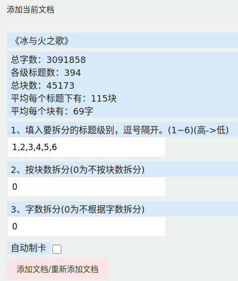
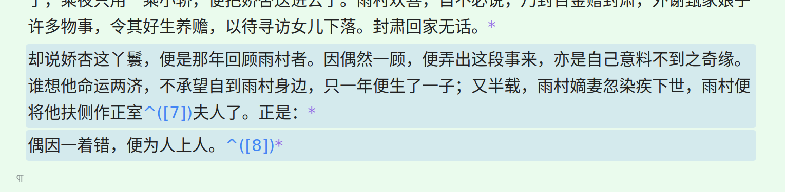

[SRC/源码](https://github.com/IAliceBobI/sy-plugins/tree/main/sy-progressive-plugin)

[中文](https://github.com/IAliceBobI/sy-plugins/blob/main/sy-progressive-plugin/README_zh_CN.md)

# Progressive Learning

The purpose of this plugin is to divide long documents into small segments, referred to as "chunks," and read them one by one. During the reading process, you can take notes and create flashcards.

With the assistance of this plugin, you can read multiple books and materials simultaneously.

> **Note:** Flashcards are the core feature, and this plugin helps us extract high-quality flashcards from the materials.

## Add Documents

**Select a long document for progressive learning. Open the plugin menu and click on "Add Current Document."**

There are three ways to split the document: `by headings`, `by number of chunks`, and `by word count`. You can use them together or separately, as shown in the image:

When combining split methods, there is a specific order to follow. It starts with splitting by headings, then treats each split of the headings as a new document, and further splits them by the number of chunks. Finally, the chunks resulting from the number of chunks split are further divided by word count.

The typical usage is: headings + number of chunks or headings + word count.

If the document is large, such as the one shown in the image with three million words, it may take a long time to split by word count. In that case, you can use the combination of headings + number of chunks.

If you have strict control over the word count, you can use the headings + word count split.

The "Auto Flashcard" option means that each chunk will be turned into a flashcard when read.

> **Note:** Some book content may require careful consideration to extract high-quality flashcards. The "Auto Flashcard" option only provides a rough flashcard creation.

> **Note:** After splitting, do not modify the original book, such as deleting some chunks, as it will cause the plugin to not find these chunks during learning.

## Start Learning

**Open the plugin menu and click on "Start Learning."**

The shortcut for "Start Learning" is `Alt+-`, which comes after "Flashcards" `Alt+0`. One is for learning, and the other is for reviewing.

**Each "chunk" has a "chunk number" prefix.**

**Within each "chunk," there is a "*" at the end of each paragraph, which links back to the original document.**

**You can freely modify the content within each "chunk," add paragraphs, create flashcards, etc. You can insert the original text at any time.**

> **Note:** The update of the index may be slightly delayed after modifying the content, as the plugin relies on the index. If you click the button immediately after modifying the text, the changes may not take effect.

* `[chunk number]`: Chunks are numbered starting from 0. `[0]` represents the beginning of a book. The second chunk is `[1]`.
* `⬅`: Retains the notes of the current segment and displays the content of the previous "chunk."
* `➡`: Retains the notes of the current segment and displays the content of the next "chunk."
* `⬇`: Inserts the content of the corresponding "chunk" from the original document.
* `🧹`: Modified original text will be retained, while unmodified text will be deleted.
* `🗑 ➡`: Deletes the notes of the current segment and continues to the next "chunk."
* `🗑 🏃`: Deletes the notes of the current segment.
* `➡ 🗃`: Turns the current document into flashcards.
* `🗃 ➡`: Deletes the flashcards of the current document, without affecting the flashcards within the document.
* `🏃`: Retains the notes of the current segment. Exit learning.
* `📚📖`: Retains the notes of the current segment. View other documents added to the "Progressive Learning" plugin.
* `🚫`: Stop pushing this book. It can be reopened in "View All Progressive Learning Documents."
* `⚡`: Open the flashcards in a tab.

> **Note:** When a "chunk" is deleted, the flashcards associated with it will also be deleted.

> **Note:** If a deleted "chunk" is read again, it will be recreated.

> **Note:** The title of each "chunk" document can be modified. However, do not modify the document's notes, as the plugin will not be able to find the document in the future.

## Read the Current Cursor Segment

If you want to start reading from a specific part of the original document, you can use the "Read Current Cursor Segment" feature.

Open an original document that has been added to progressive learning, browse to a specific location, right-click, and go to `Plugins` -> `Read Current Cursor Segment` to jump to that "chunk."

## Read Current Paragraph

If you want to start reading from a specific part of the original document, you can use the "Read Current Paragraph" feature.

Open the original document that has been added to incremental learning. Navigate to a desired location, right-click: `Plugins`->`Read Current Paragraph`, and you will be taken to that specific "chunk".

## Flashcards in Writing Style

### Single-line Selection 1

Select the portion of the content you want to extract, such as "Story" in the image below:

When generating flashcards, an input box is also added to facilitate writing.

Writing the answer on the flashcard can improve the effectiveness, as you can review the previous thoughts/answers during the next review session.

For writing articles, you can extract ambiguous parts and continuously think and write through the flashcard mechanism - progressive writing.

### Single-line Selection 2

Simply place the cursor in the content without making a selection and create a flashcard using the menu or keyboard shortcut.

### Multi-line Selection

In the image below, two lines are selected:

> Use the keyboard shortcut: Ctrl+` or Alt+E

This will generate and insert a flashcard below, as shown in the image:

> **Note:** Multi-line selection can only be used with the keyboard shortcut to generate flashcards. If you want to extract the content, use `Alt+D` separately.

> **Note:** Flashcard B in writing style represents a quote block, while C represents a code block.

# Plans

- [ ] Merge a large number of saved chunks into one document?

# Bug Reports, Suggestions

The plugin, including myself, needs ongoing improvement through long-term use. If you have any issues or suggestions, we can discuss them together.

QQ Group: 263961482

[Or submit issues on GitHub](https://github.com/IAliceBobI/sy-progressive-plugin/issues)

[Or submit issues on the official forum](https://ld246.com/tag/siyuan)

# Changelog

## 2023-11-26

* Changed the division of "N" to splitting based on the number of content blocks.

## 2023-11-25

* Added support for generating flashcards from multi-line selections.
* "Chunk" dialog displays document statistics.

## 2023-11-24

* After adding a document, it is automatically set to read-only mode.
* Added a button to open flashcards in tabbed mode.
* Swapped the keyboard shortcuts for writing style flashcards B and C.
* Added a button to delete chunks and exit.
* Added splitting the document based on the number of content blocks.

## 2023-11-23

* Added tooltips to buttons and changed button texts.
* [Updated button color scheme](https://github.com/IAliceBobI/sy-progressive-plugin/issues/1)
* Set keyboard shortcuts for writing style flashcards.
* Fixed a bug where changing books was not possible.

## 2023-11-22

* Added an option for automatic flashcard creation in documents, enabled by default.
* Fixed several bugs.
* Redefined button layout.
* Added a "Chunk" number before the title of a new file.

## 2023-11-21

* Significantly improved the speed of chunking based on titles only.
* Moved the asterisk (*) at the beginning of each sentence within the "chunk" to the end.
* Added writing flashcard functionality.
* Added the ability to ignore books.
* i18n (internationalization).

## 2023-11-20

* Removed the distinction between the original text area and note area. Any modified content, including flashcard creation and appearance, will be saved.
* Optimized note saving method.
* Skipped unnecessary introduction in the readme and proceeded to the content.

## 2023-11-19

* Further refined existing features.
* Fixed some bugs.

## 2023-11-17

* Initial release.

