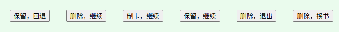

[English](https://github.com/IAliceBobI/sy-progressive-plugin/blob/main/README.md)

# 渐进学习

> [我猜下面的图九成九是裂开了😢，看这里吧！](https://gitee.com/TokenzQdBN/sy-progressive-plugin/blob/main/README_zh_CN.md)

此插件的功能就是，把长文档划分为一个个小片段，下面叫`分片`，挨个`分片`去阅读。阅读过程可以做笔记、做闪卡日后复习。

下面说说如何使用。

## 添加文档

**选择一篇较长文档，进行渐进学习。打开插件菜单，点`添加当前文档`**

这里有两种拆分方式可以同使用，也可以单独使用，如图：

添加文档后，插件会进行`分片`操作。

如果文档比较大，如图中的文档，百万字，插件`分片`起来会比较久，请耐心等待。

插件的`分片`操作不会修改原文，也不会新建其他文档，只是读取、统计、保存。

> **注意** `分片`后，原书不要修改，比如删除一些块，会导致学习时插件找不到这些块。

> **提醒** 只按照标题`分片`，百万字书籍，速度也很快。

## 开始学习

**打开插件菜单，点`开始学习`**

> `开始学习`的快捷键`Alt+-`就在`闪卡` `Alt+0`的后面。一个学习，一个复习。

**`分片`内，每段文字的末尾都有`*`链接到原始文档内。**

**`分片`中的内容可以随意修改、增加段落、制卡等，如果保留此分片，此分片内，被修改过的内容会被保留，没修改过的则被删除，以保持简洁。**

> **提醒** 内容修改后，`索引`的更新会稍微滞后，而插件依赖`索引`。如果修改文字后，立刻点`保留，继续`、`制卡，继续`可能修改的内容不会被保存。

* `[分片序号]`：分片从0开始计数，`[0]`表示一本书的开头。第二个分片为`[1]`。图中是`[39]`
* `上一分片`：当前段的笔记保留，看上一个分片的内容。
* `删除`：当前段的笔记不保留，继续看下一个分片。
* `文档制卡`：把当前文档制造为闪卡。
* `保存继续`：当前段的笔记保留，并且将删除原文和加入原文链接。继续看下一个分片。
* `退出`：当前段的笔记不保留。退出学习。
* `换书`：当前段的笔记不保留。看其他也加入到`渐进学习`插件的文档。
* `忽略本书`：不再推送本书，可在`查看所有渐进学习文档`中重新打开。

> **提醒** 被删除的分片，如果被再次阅读到，还会被重新创建出来。

> **提醒** 每个小片段的文档标题是可以修改的。但文档备注不要修改，不然插件以后找不到这个文档。

## 读光标所在段

如果想从原始文档的某个部分开始看，可以使用`读光标所在段`功能。

打开一个已经加入渐进学习的原始文档，浏览到某个位置，右键菜单：`插件`->`读光标所在段`，即可跳到此`分片`。

## 填空式闪卡

光标选择要挖空的一段内容，比如图中的“故事”：

生成闪卡时，也加入输入框，提供写作。

把答案写到闪卡，效果会更好，下次复习是还能看到上次写的思路/答案。

如果是写文章，可以挖空含糊的部分，通过闪卡机制持续思考与写作——渐进写作。

> **提示** 填空式闪卡B，就是写作部分是引述块，C则是代码块。

# 计划

- [ ] 合并大量保存后的分片到一个文档？

# BUG反馈、建议

插件需要大家包括我，在长期使用中改进，如有问题、建议可以一起讨论。

QQ群: 263961482

[或者到 Github 提交问题](https://github.com/IAliceBobI/sy-progressive-plugin/issues)

[或者到官方论坛提交问题](https://ld246.com/tag/siyuan)

# 更新日志

## 2023-11-22

* 添加自动文档制卡选项，默认勾选。
* 修复若干BUG。
* 重新定义按钮行。
* 新文件的标题前添加`分片`序号。

## 2023-11-21

* 大幅提升只按照标题`分片`的速度。
* 将`分片`内每句开头的`*`移动的句子末尾。
* 增加填空闪卡功能。
* 增加忽略书本功能。
* i18n。

## 2023-11-20

* 不分原文区与笔记区，被修改的内容，包括制卡、外观，都会被保存。
* 优化笔记保存方式。
* 删除readme开篇废话，直接进入剧情。

## 2023-11-19

* 完善已有功能。
* 修复一些BUG。

## 2023-11-17

* 第一版
