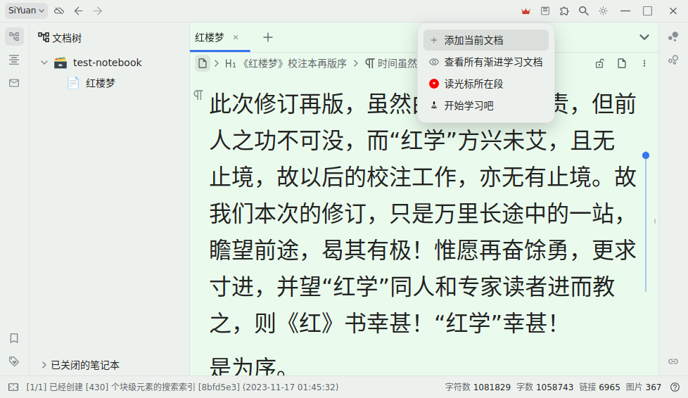
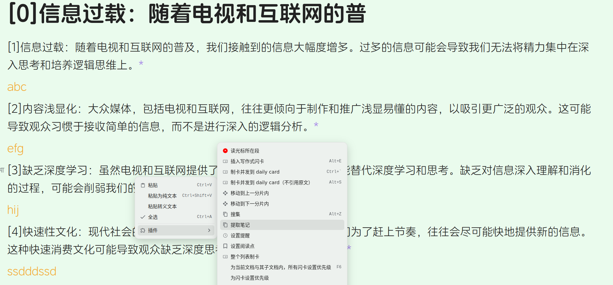

[SRC/源码](https://github.com/IAliceBobI/sy-plugins/tree/main/sy-progressive-plugin)

[English](https://github.com/IAliceBobI/sy-plugins/blob/main/sy-progressive-plugin/README.md)

> [我猜下面的图九成九是裂开了😢，看这里吧！](https://gitee.com/TokenzQdBN/sy-plugins/blob/main/sy-progressive-plugin/README_zh_CN.md)

# 前言

此插件的功能就是，把长文档划分为一个个小片段，下面叫`分片`，挨个`分片`去阅读。阅读过程可以做笔记、做闪卡。

这为我们能同时读很多书籍、材料，创造了可能性。

* **推荐阅读深度好文**：
  * [基于渐进学习插件的思源笔记渐进阅读流程——知乎](https://zhuanlan.zhihu.com/p/676485932)
  * [基于渐进学习插件的思源笔记渐进阅读流程——链滴](https://ld246.com/article/1704599752251)

**提示：** *闪卡才是核心，本插件只是帮助我们更舒服地，持续地阅读书籍，进而从书籍中提取高质量的闪卡。*

> [反馈建议，请到这里](https://awx9773btw.feishu.cn/share/base/form/shrcnO85H3V1iNvfEAc2JoQyXeh)

> [查看所有反馈，请到这里](https://awx9773btw.feishu.cn/share/base/view/shrcniyck0JM6yJS3rnj2xXGQ9f)

> [打赏鼓励，请到这里](https://gitee.com/TokenzQdBN/sy-plugins/blob/main/sy-progressive-plugin/README_zh_CN.md#bug%E5%8F%8D%E9%A6%88%E5%BB%BA%E8%AE%AE)

## 添加文档

开始使用的第一步，是打开一本书籍。

如果没有书籍，可以找其他插件导入。

**打开一篇较长文档，进行渐进学习。先打开插件菜单，点`添加当前文档`。**

插件会先提示您，要对文档进行拆分。 如图：

这里为您提供三种拆分方式，`标题`、内容`块数`、`字数`，这三种拆分方式可以同使用，也可以单独使用。

拆分方式组合使用时，是有顺序的：`按照图中，从上往下，先按照标题拆分，然后将标题拆分出来的每一份，按照块数拆分，接着再将块数拆分出来的每一份，按照字数拆分。`

听起来有点复杂，但实际使用时，也没这么啰嗦。

我总结了下面三种常用方式，一本书选一种即可。

> [打不开图片请看这里](https://gitee.com/TokenzQdBN/sy-plugins/blob/main/sy-progressive-plugin/README_zh_CN.md)

**一、按照标题拆分**

一本书籍，通常由各级标题组成。按照标题拆分，会根据填入的各级的标题，简单把书籍分成多个分片。默认h1~h6都会被拆分。如果不想拆分h5、h6，可输入：“1,2,3,4”。

例如拆分一本网文，网文只有大标题，每个标题就是一章，那每个分片就是小说的一章。

如果拆分是一些硬书，除了章，还有小节。那每个分片就是一个小节。

如果您觉得小节还是有点大，不好一次整体吃透。那还可以自己先大致阅读一遍，再按照自己的理解，为小节加上新的合适级别的标题。然后对此分片，再进行新的一轮`按照标题`拆分。

*插件支持对分片进行再分片。*

**二、按照标题+字数拆分**

如果想控制每个分片的字数，可以使用此种方式。但注意，如果书籍字数较多，拆分过程将很久，很久……

如果文档比较大，如图中的文档，三百万字，根据字数`分片`起来会比较久。

所以，可以使用标题+块数的组合方式。

**三、按照标题+块数拆分**

为了控制分片字数，又想快速拆分书籍，那可以使用标题+块数的拆分方式。

大致能够控制一个分片的字数，但不精确。嗯……好像有点不精确……

> 插件的`分片`操作不会修改原文，也不会新建其他文档，只是读取、统计、保存。

> `自动制卡`代表每个`分片`被阅读时会被制成闪卡。

> **提示** 有的书籍内容可能需要反复思考，才能提炼出来高质量的闪卡，`自动制卡`只是粗略地制卡。

> **注意** `分片`后，原书不要修改，比如删除一些块，会导致学习时插件找不到这些块。

## 开始学习

成功添加爱书后，我们进入阅读环节。

**打开插件菜单，点`开始学习`，将打开书籍的第一个分片。**

> `开始学习`的快捷键`Alt+-`就在`闪卡` `Alt+0`的后面。一个学习，一个复习。
> 随机打开一个分片：`Alt+Shift+-`

> [打不开图片请看这里](https://gitee.com/TokenzQdBN/sy-plugins/blob/main/sy-progressive-plugin/README_zh_CN.md)

**`分片`标题有`分片序号`前缀**

**`分片`内，每段文字的末尾都有`*`链接到原始文档内。**

**`分片`中的内容可以随意修改、增加段落、制卡等。可以随时插入原文。**

> **提示** 内容修改后，`索引`的更新会稍微滞后，而插件依赖`索引`。如果修改文字后，立刻点按钮，可能不会生效。

* `🗂`：打开书籍的目录，可以从目录定位要看的分片。
* `⬅`：转到上一个`分片`。
* `➡`：转到下一个`分片`。
* `⬇`：插入原文对应的`分片`内容。
* `🧹`：清理分片内的原文，但保留修改过的内容。
* `🧹🧹`：删除原文。
* `⬅ 🗑`：删除当前分片并转到上一个`分片`。
* `🗑 ➡`：删除当前分片并转到下一个`分片`。
* `🗑 🏃`：删除当前分片。
* `➕🗃`：把当前文档制为闪卡。
* `➖🗃`：删除当前文档本身的闪卡，不影响文档内的闪卡。
* `🏃`：关闭分片。
* `📚📖`：换一本书。
* `🚫`：不再推送本书，可在`查看所有渐进学习文档`中重新打开。
* `⚡`：复习当前书籍的闪卡。
* `✂📜`：对分片内的原文，按照标点进行拆分，形成一句话一行的排版，以方便阅读。
* `✂📜✅`：按标点断句，形成任务列表(可以ctrl+enter勾选任务)。
* `✂📜📌`：同上，只是拆分出来的内容，用无序列表展示出来。

> **提示** `分片`被删除时，其本身的文档闪卡也会删除。

> **提示** 被删除的`分片`，如果被再次阅读到，还会被重新创建出来。

> **提示** 每个`分片`的文档标题是可以修改的。但文档备注不要修改，不然插件以后找不到这个文档。

## 读光标所在段

如果想从原始文档的某个部分开始看，可以使用`读光标所在段`功能。

打开一个已经加入渐进学习的原始文档，浏览到某个位置，右键菜单：`插件`->`读光标所在段`，即可跳到此`分片`。

## 写作式闪卡

### 单行选择一

光标选择要`挖空`的一段内容，比如图中：

生成闪卡时，也加入输入框，提供写作。

把答案写到闪卡，效果会更好，下次复习是还能看到上次写的思路/答案。

如果是写文章，可以`挖空`有难度的部分，通过闪卡机制持续思考与写作——渐进写作。

> 使用快捷键： `Alt+E`

> [打不开图片请看这里](https://gitee.com/TokenzQdBN/sy-plugins/blob/main/sy-progressive-plugin/README_zh_CN.md)

### 单行选择二

直接把光标放在内容中，不做选择，用菜单或者快捷键制作闪卡即可。

> 使用快捷键： `Alt+E`

### 多行选择

下图选中两行：

> 使用快捷键： `Alt+E`

则生成并且插入闪卡于下方，如图：

> **提示** 如果是在分片中制卡，则卡片会放到书籍的子文件里。比如书籍名为ABC，则卡都收集到ABC-cards文件中。

## Daily Card

右键菜单或者快捷键 [Ctrl+`] 可以制卡，并且把卡片归档到 Daily Card 文件夹下。结果类似 Daily Note。

将创建目录结构如下：

文件内容：

## 命令面板工具

替换`*`与`@`为超链接`siyuan://`。快捷键`F9`。

## 移动分片内的块到上一个、下一个分片

## 搜集功能`alt+z`

可把各个分片中，选择中内容，复制到`summary-*`文件。

方便把分片内，分片之间相隔较远的内容放一起分析与总结。

对于需要前后对照着看的书籍，有较大的帮助。

如果不在分片内使用，则搜集到 daily note.

## 仿写练习流程

仿写练习流程，也可以叫翻译练习流程。

### 第一步

在分片内，每个原文内容块下方，用最简洁的语言，概括或者罗列原文要点，或者翻译原文。

然后右键`提取笔记`。

不出意外，会在分片下方生成一个`keys-`开头的文件。

> [打不开图片请看这里](https://gitee.com/TokenzQdBN/sy-plugins/blob/main/sy-progressive-plugin/README_zh_CN.md)

### 第二步

在`keys-`开头的文件内，根据之前自己的概括、翻译，用自己的语言重写原文。

最后，在`keys-`文件内，右键`对比原文`。

不出意外，会在分片下方生成一个`compare-`开头的文件。

# 还没想好的计划

- [ ] 设置每天阅读的分片数量。
- [ ] 给书籍设置优先级，大概是上下拖拽来设置吧。
- [ ] 随机推送书籍，优先级高的，推送概率高一些，也就是看的多一些。
- [ ] 统计面板。今日看的书籍，每本多少分片。
- [ ] 合并大量保存后的分片到一个文档？

# 鸣谢

**感谢所有慷慨的支持者，你们的打赏对我的插件开发意义重大。**

* 2024-03 `**清`
* 2024-03 `*理`
* 2024-02 `八面来风`
* 2024-02 `*5770`
* 2024-02 `**轩`
* 2024-02 `**航`
* 2024-02 `**航`
* 2024-02 `**龙`
* 2024-02 `**棉`
* 2024-01 [QQQOrange](https://afdian.net/u/2c73a3c6a1f011eeb98a52540025c377)
* 2024-01 `燃烬`
* 2024-01 `*舟`
* 2024-01 `*元`
* 2024-01 [赐我一胖](https://afdian.net/u/74d98cf66f0711eda8ca52540025c377)
* 2023-12 [爱发电用户_WGH7](https://afdian.net/u/ceefbee4a48111ee983f5254001e7c00)
* 2023-12 [爱发电用户_Pv38](https://afdian.net/u/3911fecaa3ad11ee8fa95254001e7c00)
* 2023-12 [赐我一胖](https://afdian.net/u/74d98cf66f0711eda8ca52540025c377)
* 2023-12 [QQQOrange](https://afdian.net/u/2c73a3c6a1f011eeb98a52540025c377)
* 2023-12 [没头脑和不高兴](https://afdian.net/u/25e08b1eb1a511edbb3d5254001e7c00)
* 2023-12 [爱发电用户_EbBe](https://afdian.net/u/d11e3c741bc711ee95eb52540025c377)
* 2023-12 [爱发电用户_b2864](https://afdian.net/u/b286492496af11eea38752540025c377)

# BUG反馈、建议

[请填写：反馈表单](https://awx9773btw.feishu.cn/share/base/form/shrcnO85H3V1iNvfEAc2JoQyXeh)

或者 [看看大家反馈了什么](https://awx9773btw.feishu.cn/share/base/view/shrcniyck0JM6yJS3rnj2xXGQ9f)

或者到`QQ`群: 263961482

[或者到 Github 提交问题](https://github.com/IAliceBobI/sy-plugins/issues)

[或者到官方论坛提交问题](https://ld246.com/tag/siyuan)

# 打赏、鼓励、催更 🎉

 

**[或者移步，爱发电](https://afdian.net/a/playerv5)**

# 更新日志

## 2024-03-05

* 修复分片图片丢失的问题。
* 不拆分带协议的段落。
* 提高分片插入速度。

## 2024-03-01

* 修复新闪卡优先级为0的bug。

## 2024-02-28

* 修改菜单文案。
* 闪卡继承原文所在文档的优先级。

## 2024-02-26

* 修复问题：对多级列表挖空，可能会在闪卡路径上暴露答案。
* 分片与闪卡中，使用`siyuan://`替代引用。
* 添加命令面板工具，替换`*`与`@`为超链接。快捷键`F9`。

## 2024-02-25

* 多行制卡后，改变原来选中内容背景。

## 2024-02-22

* 清理分片速度提高。
* 随机打开一个分片：`alt+shift+-`

## 2024-02-18

* 闪卡的上下文只保留文件名，不保留文件的具体位置。

## 2024-02-16

* 仿写流程：与原文比较时，添加横线.

## 2024-02-08

* prog-marked 改为 text

## 2024-02-07

* 添加菜单icon

## 2024-02-06

* 分片笔记颜色调整。

## 2024-02-03

* 书籍文档加入属性标记，番茄工具箱底部反链忽略书籍文档。
* `alt+=` 查看所有渐进学习书籍。
* 搜集功能：如果不在分片内使用，则搜集到 daily note.
* 断句功能：添加对`》`与`>`的识别。

## 2024-02-02

* 改进添加书籍页面。

## 2024-02-01

* 修复删除书籍相关bug.
* 修复重复打开分片的bug.

## 2024-01-30

* 更新依赖库

## 2024-01-28

* 修复断句功能没有保留图片的问题。
* 如果书籍配置为断句，在插入分片前先断句，减少分片准备时间。

## 2024-01-27

* 重新整理查看所有在读书籍的界面。
* 在查看所有书籍面板中，可以配置插入分片时，自动断句。

## 2024-01-26

* 优化大分片断句。

## 2024-01-25

* topbar菜单放入右键，手机也支持电脑端所有功能。除了不能打开文档打开文档需要手动操作。
* 支持手机伺服

## 2024-01-24

* 支持英文句号断句。
* 优化大分片断句性能。
* 修复新本思源无法显示渐进阅读分片下的闪卡问题。
* 支持按照粗体行看成标题拆分。默认拆分方式为：1,2,3,4,5,6,b。b为粗体独占一行。

## 2024-01-23

* 添加`仿写`/`翻译`练习流程。详见上方文档说明。
* 闪卡中复习分片，可选择是否隐藏下方按钮。
* 分片内的非原文内容，改变颜色。
* 修改readme.

## 2024-01-22

* 整个分片在复习时，不显示底部按钮。

## 2024-01-20

* 调整闪卡引用样式。

## 2024-01-19

* 分片内断句后，自动定位到分片内第一个块。
* 现在，列表项制卡，也能引用到原文了。

## 2024-01-18

* 创建分片时，为每个段落标上序号。（需要从配置打开）
* 添加搜集功能，`alt+z`可把分片中内容，复制到`summary-`文件。方便把分片内，分片之间相隔较远的内容放一起分析与总结。
* 更新readme.

## 2024-01-17

* 重命名：新建文件以 `cards-`、`contents-`、`pieces-`开头。

## 2024-01-15

* 提供选项，分片内制卡，放于分片的子文档内。
* 支持按照自选的标题等级拆分。
* 优化：分片的分片支持得更好。
* 原文创建闪卡将放到其子文件内。

## 2024-01-14

* 为闪卡添加面包屑。
* 分片中的按钮可以配置隐藏或是显示。

## 2024-01-13

* 分片内增加新的段落拆分方式。

## 2024-01-10

* 删除分片前，弹出确认框。
* 修复分片，无法断句的问题。

## 2024-01-09

* 更新readme图片。
* 深度复制：分片、闪卡对原内容的复制，更加彻底。

## 2024-01-08

* 增加配置选项：制作的列表闪卡，第二项开始缩进。
* 增加打开分片的同时打开`*-cards`文件的选项。
* 拆分为段落块功能，会在每个段落前加个中文空格。
* 更新readme。

## 2024-01-07

* alt+e 快捷键改为制卡后打开卡片文件于右侧。

## 2024-01-05

* 一些改进。
* 拆分段落功能：增加支持列表块，引述块，代码块等。

## 2024-01-04

* 增加功能：分片内可以按照标点断句。
* 大幅提高分片生成速度。
* alt+e：同时引入对原文链接，与对制卡块的链接。
* 升级依赖库。

## 2024-01-03

* 默认，当前分片，不显示上一分片的内容，如果需要可以在配置中开启。
* 移除分片内的小点，改为动画。代表新内容有原文标记，alt+e制卡后有原文链接。

## 2024-01-02

* 快捷键不再在应用外也能触发。如果有快捷键冲突请自行设置快捷键。
* 添加功能：制卡发送到 daily card，不引用原文。快捷键： `Alt+S`

## 2024-01-01

* 手机端不显示topbar图标。

## 2023-12-31

* 分片内行首字颜色恢复正常。
* 添加功能：移动分片内容块到上一个或者下一个分片中。需要目标分片存在。如果分片删除重建，则会恢复最初，没移动过的样子。
* 移除多余图标

## 2023-12-30

* 分片中的所有文本块，如果使用`alt+e`制卡，闪卡会带有原文的引用。(插件尽可能选择合适的原文位置)
* 每个分片都使用书籍名做别名。
* 允许将分片视为书籍，进行再次拆分。
* 创建分片后，不再自动把书籍设置为只读。

## 2023-12-29

* 默认不勾选按块数拆分。
* 上一分片的内容字体缩小。
* 按照块数拆分时，标题块不再统计到块数里。

## 2023-12-28

* 添加分片后，自动打开第一个分片。
* 书籍列表倒序展示。
* 修复一个按照字数分片的bug。

## 2023-12-26

* daliy card: [ctrl+`] 不再插入嵌入块。
* 分片底部按钮行：添加打开书本目录按钮。
* 分片底部按钮行：以tab的方式打开闪卡，只打开，在本书中或者在本书的子文件中的闪卡。
* 在分片中做闪卡：`alt+e`。不在分片底部插入闪卡，而是将闪卡放入书籍下的一个文件中。
* 书籍目录优化。

## 2023-12-24

* 改头像……

## 2023-12-20

* 不再默认勾选分片制卡
* 修正无标题的文档的统计信息

## 2023-12-19

* 闪卡：添加闪卡到 daily card 同时，也添加闪卡的嵌入块，到子文件内。子文件以当前文件名加"-card"后缀命名。
* 闪卡：制卡后，原文也做粉色标记。
* 升级依赖库。

## 2023-12-18

* 新增：`制卡并发到DailyCard`功能，把卡片归档，仿照daily note.
* 制卡成功后，弹出消息通知。
* 分片中额外包含上一个分片的最后一个块内容。
* 修复bug。

## 2023-12-17

* 闪卡可以配置是否带写作框，默认带引述框，可以在配置中修改。
* 添加写作闪卡时，如果在分片外，那么添加对原文的引用，如果是在分片内，则继承分片内容对原文的引用。
* 添加写作闪卡时，如果在分片内，则添加到分片底部。如果在分片外，则添加到原文下面。

## 2023-12-11

* 按照字数分片稍微提速。
* 修复有的分片没有自动删除的问题。

## 2023-12-10

* 提速`查看所有渐进学习文档`功能。

## 2023-12-07

* 不接收 protyle 销毁事件。

## 2023-12-06

* 调整Dialog
* 修复切换分片与`在当前页签中打开`的冲突。

## 2023-12-02

* 重构。
* 修复分片没有引用原文GUB。

## 2023-12-01

* 制作写作闪卡时，不再加对原文的引用。原文是什么样，就保留什么样。

## 2023-11-29

* 代码重构
* 使用ial替代memo
* 删除块前做检查，避免重建索引

## 2023-11-27

* 提升第一种写作式闪卡创建方式的效果，保留原文本的外观。

## 2023-11-26

* 把N等分改为按照块数拆分。

## 2023-11-25

* 支持多行选择来生成闪卡。
* `分片`对话框显示文档的统计信息。

## 2023-11-24

* 添加文档后，自动把文档设置为只读模式。
* 添加以tab方式打开闪卡的按钮。
* 调换写作式制卡B与C的快捷键。
* 添加删除分片并退出按钮。
* 添加按照内容块数量拆分文档的方式。

## 2023-11-23

* 给按钮加入 tooltip，改变按钮文本。
* [更新按钮色系](https://github.com/IAliceBobI/sy-progressive-plugin/issues/1)
* 写作式闪卡设置快捷键。
* 修复无法换书的BUG。

## 2023-11-22

* 添加自动文档制卡选项，默认勾选。
* 修复若干BUG。
* 重新定义按钮行。
* 新文件的标题前添加`分片`序号。

## 2023-11-21

* 大幅提升只按照标题`分片`的速度。
* 将`分片`内每句开头的`*`移动的句子末尾。
* 增加写作闪卡功能。
* 增加忽略书本功能。
* i18n。

## 2023-11-20

* 不分原文区与笔记区，被修改的内容，包括制卡、外观，都会被保存。
* 优化笔记保存方式。
* 删除readme开篇废话，直接进入剧情。

## 2023-11-19

* 完善已有功能。
* 修复一些BUG。

## 2023-11-17

* 第一版
