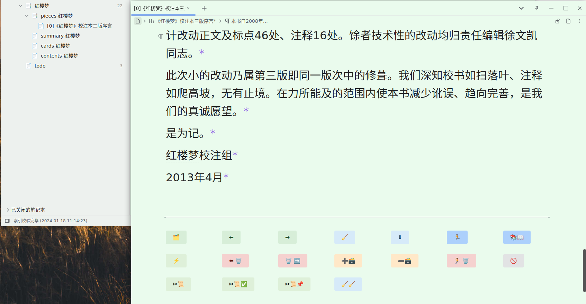

[SRC/源码](https://github.com/IAliceBobI/sy-plugins/tree/main/sy-progressive-plugin)

[English](https://github.com/IAliceBobI/sy-plugins/blob/main/sy-progressive-plugin/README.md)

# 渐进学习

> [我猜下面的图九成九是裂开了😢，看这里吧！](https://gitee.com/TokenzQdBN/sy-plugins/blob/main/sy-progressive-plugin/README_zh_CN.md)

此插件的功能就是，把长文档划分为一个个小片段，下面叫`分片`，挨个`分片`去阅读。阅读过程可以做笔记、做闪卡。

通过插件的协助，我们可以同时读很多书籍、材料。

> **提示** 闪卡才是核心，本插件只是帮助我们从资料中提取高质量的闪卡。

> [请填写：反馈表单](https://awx9773btw.feishu.cn/share/base/form/shrcnO85H3V1iNvfEAc2JoQyXeh)
> 或者 [看看大家反馈了什么](https://awx9773btw.feishu.cn/share/base/view/shrcniyck0JM6yJS3rnj2xXGQ9f)

## 添加文档

**选择一篇较长文档，进行渐进学习。打开插件菜单，点`添加当前文档`**

这里有三种拆分方式，`标题`、内容`块数`、`字数`，可以同使用，也可以单独使用，如图：

拆分方式组合使用时，是有顺序的，从上往下，先按照标题拆分，然后将标题拆分出来的每一份都看做是一个新文档，再按照块数拆分，最后在块数拆分的结果上，如法炮制，按照字数拆分。

通常使用方式是：标题+块数、标题+字数。

如果文档比较大，如图中的文档，三百万字，根据字数`分片`起来会比较久。可以使用标题+块数的组合方式。

如果对字数的控制要求比较高，可以使用标题+字数来拆分。

插件的`分片`操作不会修改原文，也不会新建其他文档，只是读取、统计、保存。

`自动制卡`代表每个`分片`被阅读时会被制成闪卡。

> **提示** 有的书籍内容可能需要反复思考，才能提炼出来高质量的闪卡，`自动制卡`只是粗略地制卡。

> **注意** `分片`后，原书不要修改，比如删除一些块，会导致学习时插件找不到这些块。

## 开始学习

**打开插件菜单，点`开始学习`**

`开始学习`的快捷键`Alt+-`就在`闪卡` `Alt+0`的后面。一个学习，一个复习。

**`分片`标题有`分片序号`前缀**

**`分片`内，每段文字的末尾都有`*`链接到原始文档内。**

**`分片`中的内容可以随意修改、增加段落、制卡等。可以随时插入原文。**

> **提示** 内容修改后，`索引`的更新会稍微滞后，而插件依赖`索引`。如果修改文字后，立刻点按钮，可能不会生效。

* `[分片序号]`：分片从0开始计数，`[0]`表示一本书的开头。第二个分片为`[1]`。
* `⬅`：当前段的笔记保留，看上一个`分片`的内容。
* `➡`：当前段的笔记保留，看下一个`分片`的内容。
* `⬇`：插入原文对应的`分片`内容。
* `🧹`：被修改过的原文会保留，没被修改过的，会被删除。
* `🗑 ➡`：删除当前段的笔记，继续看下一个`分片`。
* `🗑 🏃`：删除当前段的笔记。
* `➡ 🗃`：把当前文档制为闪卡。
* `🗃 ➡`：删除当前文档本身的闪卡，不影响文档内的闪卡。
* `🏃`：当前段的笔记保留。退出学习。
* `📚📖`：当前段的笔记保留。看其他也加入到`渐进学习`插件的文档。
* `🚫`：不再推送本书，可在`查看所有渐进学习文档`中重新打开。
* `⚡`：以tab的方式打开闪卡。

> **提示** `分片`被删除时，其本身的文档闪卡也会删除。

> **提示** 被删除的`分片`，如果被再次阅读到，还会被重新创建出来。

> **提示** 每个`分片`的文档标题是可以修改的。但文档备注不要修改，不然插件以后找不到这个文档。

## 读光标所在段

如果想从原始文档的某个部分开始看，可以使用`读光标所在段`功能。

打开一个已经加入渐进学习的原始文档，浏览到某个位置，右键菜单：`插件`->`读光标所在段`，即可跳到此`分片`。

## 写作式闪卡

### 单行选择一

光标选择要挖空的一段内容，比如图中的“故事”：

生成闪卡时，也加入输入框，提供写作。

把答案写到闪卡，效果会更好，下次复习是还能看到上次写的思路/答案。

如果是写文章，可以挖空含糊的部分，通过闪卡机制持续思考与写作——渐进写作。

### 单行选择二

直接把光标放在内容中，不做选择，用菜单或者快捷键制作闪卡即可。

### 多行选择

下图选中两行：

> 使用快捷键： Ctrl+` 或者 Alt+E

则生成并且插入闪卡于下方，如图：

> **提示** 写作式闪卡B，就是写作部分是引述块，C则是代码块。

## Daily Card

右键菜单或者快捷键 [Ctrl+`] 可以制卡，并且把卡片归档到 Daily Card 文件夹下。结果类似 Daily Note。

> 添加闪卡到 daily card 同时，也添加闪卡的嵌入块，到子文件内。子文件以当前文件名加"-card"后缀命名。

将创建目录结构如下：

文件内容：

# 还没想好的计划

- [ ] 设置每天阅读的分片数量。
- [ ] 给书籍设置优先级，大概是上下拖拽来设置吧。
- [ ] 随机推送书籍，优先级高的，推送概率高一些，也就是看的多一些。
- [ ] 统计面板。今日看的书籍，每本多少分片。
- [ ] 合并大量保存后的分片到一个文档？

# 鸣谢

**感谢所有慷慨的支持者，你们的打赏对我的插件开发意义重大。**

* 2023-12-13 [没头脑和不高兴](https://afdian.net/u/25e08b1eb1a511edbb3d5254001e7c00)
* 2023-12-11 [爱发电用户_EbBe](https://afdian.net/u/d11e3c741bc711ee95eb52540025c377)
* 2023-12-10 [爱发电用户_b2864](https://afdian.net/u/b286492496af11eea38752540025c377)

# BUG反馈、建议

[请填写：反馈表单](https://awx9773btw.feishu.cn/share/base/form/shrcnO85H3V1iNvfEAc2JoQyXeh)

或者 [看看大家反馈了什么](https://awx9773btw.feishu.cn/share/base/view/shrcniyck0JM6yJS3rnj2xXGQ9f)

或者到`QQ`群: 263961482

[或者到 Github 提交问题](https://github.com/IAliceBobI/sy-plugins/issues)

[或者到官方论坛提交问题](https://ld246.com/tag/siyuan)

# 更新日志

## 2023-12-19

* 闪卡：添加闪卡到 daily card 同时，也添加闪卡的嵌入块，到子文件内。子文件以当前文件名加"-card"后缀命名。
* 闪卡：制卡后，原文也做粉色标记。
* 升级依赖库。

## 2023-12-18

* 新增：`制卡并发到DailyCard`功能，把卡片归档，仿照daily note.
* 制卡成功后，弹出消息通知。
* 分片中额外包含上一个分片的最后一个块内容。
* 修复bug。

## 2023-12-17

* 闪卡可以配置是否带写作框，默认带引述框，可以在配置中修改。
* 添加写作闪卡时，如果在分片外，那么添加对原文的引用，如果是在分片内，则继承分片内容对原文的引用。
* 添加写作闪卡时，如果在分片内，则添加到分片底部。如果在分片外，则添加到原文下面。

## 2023-12-11

* 按照字数分片稍微提速。
* 修复有的分片没有自动删除的问题。

## 2023-12-10

* 提速`查看所有渐进学习文档`功能。

## 2023-12-07

* 不接收 protyle 销毁事件。

## 2023-12-06

* 调整Dialog
* 修复切换分片与`在当前页签中打开`的冲突。

## 2023-12-02

* 重构。
* 修复分片没有引用原文GUB。

## 2023-12-01

* 制作写作闪卡时，不再加对原文的引用。原文是什么样，就保留什么样。

## 2023-11-29

* 代码重构
* 使用ial替代memo
* 删除块前做检查，避免重建索引

## 2023-11-27

* 提升第一种写作式闪卡创建方式的效果，保留原文本的外观。

## 2023-11-26

* 把N等分改为按照块数拆分。

## 2023-11-25

* 支持多行选择来生成闪卡。
* `分片`对话框显示文档的统计信息。

## 2023-11-24

* 添加文档后，自动把文档设置为只读模式。
* 添加以tab方式打开闪卡的按钮。
* 调换写作式制卡B与C的快捷键。
* 添加删除分片并退出按钮。
* 添加按照内容块数量拆分文档的方式。

## 2023-11-23

* 给按钮加入 tooltip，改变按钮文本。
* [更新按钮色系](https://github.com/IAliceBobI/sy-progressive-plugin/issues/1)
* 写作式闪卡设置快捷键。
* 修复无法换书的BUG。

## 2023-11-22

* 添加自动文档制卡选项，默认勾选。
* 修复若干BUG。
* 重新定义按钮行。
* 新文件的标题前添加`分片`序号。

## 2023-11-21

* 大幅提升只按照标题`分片`的速度。
* 将`分片`内每句开头的`*`移动的句子末尾。
* 增加写作闪卡功能。
* 增加忽略书本功能。
* i18n。

## 2023-11-20

* 不分原文区与笔记区，被修改的内容，包括制卡、外观，都会被保存。
* 优化笔记保存方式。
* 删除readme开篇废话，直接进入剧情。

## 2023-11-19

* 完善已有功能。
* 修复一些BUG。

## 2023-11-17

* 第一版
